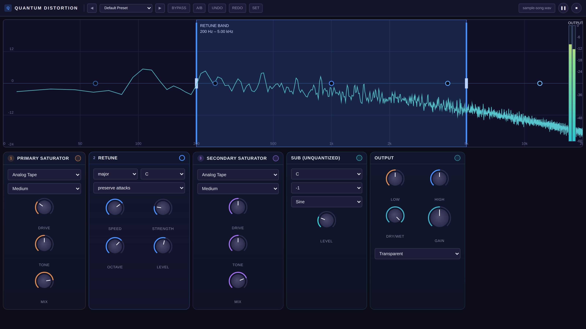

# Quantum Distortion




**Spectral pitch quantization meets time-domain distortion.** Quantum Distortion is an experimental DSP engine that snaps audio frequencies to a musical scale while applying creative distortion effects, producing unique harmonic textures from any source material.

This Python prototype validates the DSP architecture before building a production JUCE VST plugin. It ships with a Streamlit UI, a CLI renderer, and an Electron/React desktop app for real-time processing.

## Features

### DSP Engine
- **Spectral Pitch Quantization** -- Snap frequency content to any key and scale (major, minor, pentatonic, dorian, mixolydian, harmonic minor) with adjustable snap strength and spectral smearing
- **Distortion Modes** -- Wavefold (mirrored clipping for rich harmonics) and Soft Tube (tanh saturation with warmth control)
- **Multiband Processing** -- Linkwitz-Riley crossover keeps the low band in time-domain for tight transients while the high band runs through the full STFT pipeline
- **Spectral FX** -- Bitcrush, phase dispersal, and bin scrambling for creative frequency-domain effects
- **Peak Limiter** -- Lookahead limiting with configurable ceiling to keep output safe
- **Dry/Wet Mix** -- Blend processed and original signals from subtle glue to full destruction

### Interfaces
- **Electron/React Desktop App** -- Real-time audio processing with knob-based effect modules, spectrum analyzer, and a dynamic FX chain builder
- **Streamlit Web UI** -- Interactive browser-based interface with visualization tap points (spectrum, oscilloscope, phase scope)
- **CLI Renderer** -- Offline file-to-file processing with full parameter control and named presets

### Presets

Four portfolio-ready presets are included:

| Preset | Key/Scale | Style |
|--------|-----------|-------|
| **Chordal Noise Wash** | C minor | Smeared harmonic wash from noisy sources |
| **Controlled Dubstep Growl** | F minor | Aggressive folded bass locked to root + fifth |
| **Perc To Tonal Clang** | D minor | Percussive hits pushed into pitched metallic impacts |
| **Subtle Tube Glue** | C major | Gentle saturation with light quantization |

## Signal Flow

```
Input Audio (mono float32)
    │
    ├─ Single-Band Path ─────────────────────────────────┐
    │   STFT ➜ Pre-Quant ➜ Distortion ➜ Post-Quant ➜ Limiter ➜ Dry/Wet
    │                                                     │
    ├─ Multiband Path ───────────────────────────────────┤
    │   Crossover @ 300 Hz                                │
    │   ├─ Low:  Saturation ➜ Mono-maker ➜ Trim          │
    │   └─ High: STFT ➜ Spectral FX ➜ Quant ➜ Dist ➜ …  │
    │   Recombine                                         │
    │                                                     │
    ▼                                                     │
Output Audio ◄────────────────────────────────────────────┘
```

## Quick Start

### Requirements

- Python 3.10+
- Node.js 18+ (for the Electron UI)

### Python Setup

```bash
python -m venv .venv
source .venv/bin/activate
pip install -r requirements.txt
```

### CLI Offline Render

```bash
# Render with default parameters
python scripts/render_cli.py \
  --infile examples/example_bass.wav \
  --outfile examples/example_bass_qd.wav

# Render with a named preset
python scripts/render_preset.py \
  --infile examples/example_bass.wav \
  --outfile examples/example_bass_growl.wav \
  --preset "Controlled Dubstep Growl"

# List all presets
python scripts/render_preset.py --list-presets
```

### Streamlit UI

```bash
streamlit run quantum_distortion/ui/app_streamlit.py
```

Open the local URL in your browser, load an audio file, tweak controls, and hit Render.

### Electron Desktop App

```bash
cd ui
npm install
npm run electron:dev      # Development mode
npm run electron:build    # Build production installer
```

The Electron app is the main interactive surface for the current retune workflow. The Streamlit and CLI paths are still useful for prototype validation, but the polyphonic retune engine and note-routing UI live in the Electron app.

## Using The Retune Module

The `Retune` module is a polyphonic note-remapping stage. It listens for multiple note groups in the incoming audio, maps those groups to a musical target set, then resynthesizes the tonal content while preserving as much attack and texture as possible.

### Basic Workflow

1. Load audio in the Electron app and enable the `Retune` module.
2. Set `Key` and `Scale` at the top of the module.
3. Leave `Custom` off if you want standard musical behavior. In this mode the engine uses the selected key and scale directly, and the target mask stays hidden.
4. Turn `Custom` on only when you want to build a custom note set. This reveals the target mask and `Out of Mask` behavior.
5. If you want extra sub reinforcement, use the separate `Sub` module after retune. The sub is informed by the retune engine, but it is intentionally outside the retune block so it does not get saturated too early.

### What The Spectrum Is Showing

When retune is active, the spectrum is the primary feedback surface:

- Active tonal groups are overlaid directly on the analyzer instead of being listed in a large status panel.
- The overlay shows which note groups are being mapped, preserved, or muted.
- The retune header still reports lightweight state such as tracking, confidence, low-end lock, and attack-preserve state.

If the overlay shows unstable note movement, reduce correction pressure before assuming the detector is wrong.

### Top Controls

- `Key`: root note for the target scale or default target mask.
- `Scale`: target scale family. Available scales are `major`, `minor`, `pentatonic`, `dorian`, `mixolydian`, `harmonic minor`, and `chromatic`.
- `Custom`: reveals the target mask. Leave this off for normal scale-aware retuning.

### Custom Target Mask

When `Custom` is enabled:

- Click note buttons to allow or disallow pitch classes.
- `Reset To Scale` restores the mask to the currently selected key and scale.
- `Out of Mask` controls what happens to notes outside the allowed target set:
  - `Nearest`: remap to the closest allowed note.
  - `Preserve`: keep the original note instead of forcing a move.
  - `Mute`: suppress that tracked tonal group.

Use `Preserve` when you want the retune engine to stay musical without flattening every non-scale color tone. Use `Mute` only for more aggressive sound-design cases.

### Performance Controls

- `Strength`: overall correction amount. Higher values push note groups more strongly toward their targets.
- `Deadband`: tolerance around an in-scale note. Increase this if material already in key is still sounding over-corrected.
- `Gate`: minimum confidence required before the engine actively retunes a note group. Increase this if you hear flutter, note bouncing, or false locks.
- `Texture`: blends more of the original spectral detail back into the retuned result. Increase it if the result feels too clinical or hollow.
- `Low Blend`: balance between the dedicated low-end retune lane and the original low-frequency body.
- `Air`: amount of high-frequency air/noise retained above the retuned tonal body.

### Toggles

- `Preserve Attacks`: reduces retune strength during transients so attacks stay sharper and less smeared.
- `Collapse Duplicates`: allows multiple source groups to collapse onto the same target pitch class. Leave this off if you want more separation between tracked notes.

### Recommended Starting Points

- Material already in key: lower `Strength`, raise `Deadband`, keep `Custom` off.
- Chords and pads: keep `Preserve Attacks` on, start with moderate `Strength`, and avoid `Mute` unless you want obvious note removal.
- Bass-heavy material: use moderate `Low Blend`, then bring in the separate `Sub` module only if the low end needs reinforcement.
- Noisy or unstable sources: raise `Gate` so the engine preserves uncertain groups instead of bouncing between targets.

### Troubleshooting

- If the effect sounds too active even when the sample is already in the correct key, increase `Deadband` first.
- If notes seem to bounce back and forth, increase `Gate` and reduce `Strength`.
- If attacks smear or chatter, keep `Preserve Attacks` enabled.
- If the output gets too synthetic, reduce `Strength`, increase `Texture`, and lower the `Sub` amount.
- If the result feels thin in the highs, increase `Air`.

## Validation & Profiling

```bash
# Profile the DSP pipeline
python scripts/profile_pipeline.py \
  --infile examples/example_bass.wav

# Measure scale alignment (average cents offset)
python scripts/validate_dsp_metrics.py \
  --infile examples/example_bass.wav \
  --key C --scale minor
```

## Testing

```bash
python -m pytest tests/ -x -q
```

68 tests covering STFT round-trip fidelity, quantizer accuracy, distortion modes, multiband crossover, limiter compliance, preset loading, and more.

## Tech Stack

| Layer | Technologies |
|-------|-------------|
| DSP Core | NumPy, SciPy, Numba (JIT), Matplotlib |
| Audio I/O | SoundFile, Librosa (optional analysis) |
| Web UI | Streamlit |
| Desktop App | Electron 41, React 19, TypeScript, Vite, Tailwind CSS |

## Documentation

- [Architecture](docs/architecture.md) -- Signal flow, module map, design decisions
- [API Reference](docs/api.md) -- `process_audio()`, `PipelineConfig`, I/O, CLI scripts
- [Development Guide](docs/development.md) -- Setup, testing, contributing

## License

See [LICENSE](LICENSE) for details.
